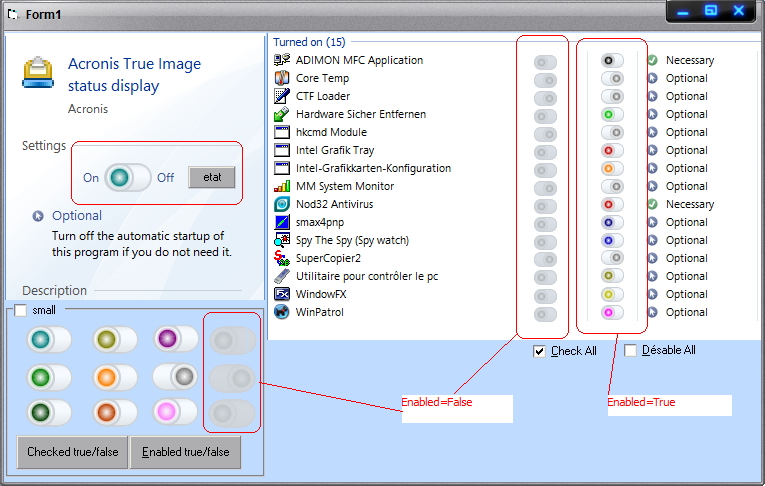



## Update width Antialising \(Very beautiful now\) for my MM CheckBox 2009

### Description

Version 2.1 of my very simple and beautiful CheckBox (MM CheckBox 2009 v2.0). Now with beautiful Antialising (perfect circle) (thanks to "Dana Seaman" for this technique)

Check the Screen Capture

my blog, http://mmvb2008.unblog.fr/ (some sympathetic utility makes in vb6)
 
### More Info
 
update the design of Enabled Status = false (see screenshot)

             |
---                |---
**Submitted On**   |2009-01-12 16:33:06
**By**             |[Simo Simo](https://github.com/Planet-Source-Code/PSCIndex/blob/master/ByAuthor/simo-simo.md)
**Level**          |Intermediate
**User Rating**    |5.0 (50 globes from 10 users)
**Compatibility**  |VB 6\.0
**Category**       |[Custom Controls/ Forms/  Menus](https://github.com/Planet-Source-Code/PSCIndex/blob/master/ByCategory/custom-controls-forms-menus__1-4.md)
**World**          |[Visual Basic](https://github.com/Planet-Source-Code/PSCIndex/blob/master/ByWorld/visual-basic.md)
**Archive File**   |[Update\_wid2141181222009\.zip](https://github.com/Planet-Source-Code/simo-simo-update-width-antialising-very-beautiful-now-for-my-mm-checkbox-2009__1-71635/archive/master.zip)

### API Declarations

BlendColor

